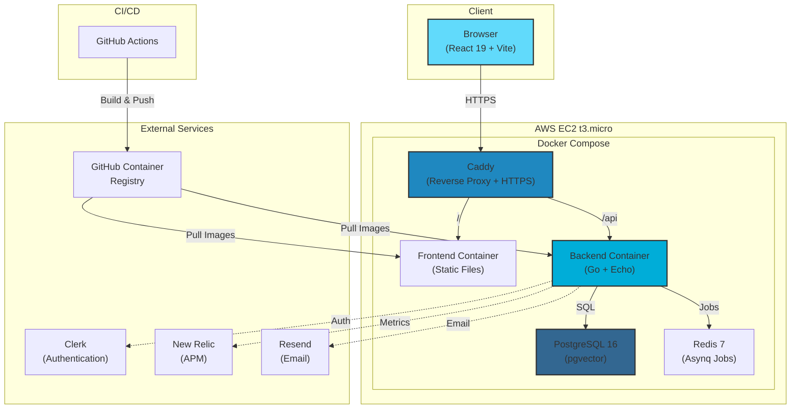

# Ark

A production-ready self-hosted asset management system for homelabs. Track your infrastructure (servers, VMs, containers, network devices) and maintain searchable logs of configuration changes. Built with Go backend and React frontend using modern best practices and clean architecture.

**Live Production**: https://arkcore.dev

## Features

- **Asset Management**: Track servers, VMs, containers, NAS, and network equipment
- **Log History**: Chronological logs of configuration changes and maintenance tasks
- **Full-text Search**: PostgreSQL-based search with tsvector and trigram matching
- **Multi-tenant**: Secure user isolation via Clerk authentication
- **Self-Hosted**: Run on your own infrastructure with Docker Compose
- **Production-Ready**: CI/CD with GitHub Actions, observability with New Relic
- **AI-Powered Search**: Natural language querying with RAG (planned for V2)

## Tech Stack

**Backend**:
- Go 1.24 with Echo framework
- PostgreSQL 16 with pgvector extension
- Redis 7 for background jobs (Asynq)
- Clerk SDK v2 for authentication
- New Relic APM for observability

**Frontend**:
- React 19 with TypeScript
- Vite 7 build tool
- TailwindCSS v4
- TanStack Query for data fetching
- Clerk for authentication
- Playwright for E2E testing

**Infrastructure**:
- Docker and Docker Compose
- GitHub Actions for CI/CD
- Caddy for reverse proxy and automatic HTTPS
- AWS EC2 deployment (t3.micro)

## Architecture Overview



**Key Components**:
- **Frontend**: React SPA with TailwindCSS, served as static files
- **Backend**: Go REST API with clean architecture (handlers → services → repositories)
- **Database**: PostgreSQL with full-text search and vector support for future AI features
- **Auth**: Two-phase JWT validation (Clerk SDK → user context)
- **Jobs**: Background processing for emails and future tasks
- **Deployment**: Single VM with Docker Compose, cost-optimized at $15-25/month

## Quick Start

### Local Development

**Prerequisites**:
- Go 1.24+
- Node.js 22+ and Bun
- PostgreSQL 16+
- Redis 8+
- Task runner (`brew install go-task`)

**Setup**:

```bash
# 1. Clone the repository
git clone https://github.com/srauf24/ark.git
cd ark

# 2. Install dependencies
bun install

# 3. Set up environment variables
cp apps/backend/.env.example apps/backend/.env
cp apps/frontend/.env.example apps/frontend/.env.local
# Edit .env files with your configuration

# 4. Start PostgreSQL and Redis
brew services start postgresql@16  # macOS
brew services start redis           # macOS

# 5. Run database migrations
cd apps/backend && task migrations:up

# 6. Start development servers
cd ../.. && bun dev
```

The API will be available at `http://localhost:8080` and the frontend at `http://localhost:3000`.

### Production Deployment with Docker

**Prerequisites**:
- Docker 20.10+ and Docker Compose v2
- Domain with DNS configured (optional but recommended)

**Setup**:

```bash
# 1. Clone the repository
git clone https://github.com/srauf24/ark.git
cd ark

# 2. Create production environment file
cp .env.example .env
# Edit .env with production secrets

# 3. Pull and start all services
docker compose pull
docker compose up -d

# 4. Check logs
docker compose logs -f
```

Services will be available at:
- Frontend: http://localhost (or your domain)
- Backend API: http://localhost/api (or api.yourdomain.com)

See [`docs/claude/DEPLOYMENT_GUIDE.md`](docs/claude/DEPLOYMENT_GUIDE.md) for complete deployment instructions including AWS EC2 setup, Cloudflare configuration, and troubleshooting.

## Project Structure

```
ark/
├── apps/
│   ├── backend/          # Go REST API (Echo framework)
│   └── frontend/         # React application (Vite + TypeScript)
├── packages/
│   ├── zod/              # Shared Zod schemas and types
│   ├── openapi/          # OpenAPI spec generation
│   └── emails/           # Email templates
├── docs/
│   └── claude/           # Comprehensive documentation
├── docker-compose.yml    # Production deployment
├── Dockerfile.backend    # Backend container
├── Dockerfile.frontend   # Frontend container
├── Caddyfile             # Reverse proxy config
└── README.md             # This file
```

## Documentation

Comprehensive documentation is available in the [`docs/claude/`](docs/claude/) directory:

- **[ARCHITECTURE.md](docs/claude/ARCHITECTURE.md)** - Project overview, clean architecture, domain models
- **[DEV_GUIDE.md](docs/claude/DEV_GUIDE.md)** - Development commands, troubleshooting, common tasks
- **[BACKEND_GUIDE.md](docs/claude/BACKEND_GUIDE.md)** - API endpoints, configuration, testing
- **[FRONTEND_GUIDE.md](docs/claude/FRONTEND_GUIDE.md)** - React setup, environment variables, testing
- **[CICD_GUIDE.md](docs/claude/CICD_GUIDE.md)** - GitHub Actions, Docker builds
- **[DEPLOYMENT_GUIDE.md](docs/claude/DEPLOYMENT_GUIDE.md)** - AWS EC2, production setup, troubleshooting
- **[OBSERVABILITY_GUIDE.md](docs/claude/OBSERVABILITY_GUIDE.md)** - Logging, New Relic, metrics

Quick references are also available in app and package directories:
- [`apps/backend/CLAUDE.backend.md`](apps/backend/CLAUDE.backend.md)
- [`apps/frontend/CLAUDE.frontend.md`](apps/frontend/CLAUDE.frontend.md)
- [`packages/openapi/CLAUDE.openapi.md`](packages/openapi/CLAUDE.openapi.md)
- [`packages/zod/CLAUDE.zod.md`](packages/zod/CLAUDE.zod.md)

## Development Commands

```bash
# Monorepo-wide
bun dev                # Start all development servers
bun build              # Build all packages
bun lint               # Lint all packages
bun typecheck          # Type check all TypeScript

# Backend (from apps/backend)
task run               # Run the application
task migrations:up     # Apply database migrations
go test ./...          # Run tests

# Frontend (from apps/frontend)
bun dev                # Start development server
bun test               # Run unit tests (Vitest)
bun test:e2e           # Run E2E tests (Playwright)
```

See [`docs/claude/DEV_GUIDE.md`](docs/claude/DEV_GUIDE.md) for complete command reference.

## API Documentation

OpenAPI specification is available at `http://localhost:8080/openapi.json` when the backend is running.


## Environment Variables

**Backend** (prefix with `ARK_`):
- `ARK_DATABASE.*` - PostgreSQL connection settings
- `ARK_AUTH.CLERK.*` - Clerk authentication
- `ARK_REDIS.*` - Redis connection
- `ARK_SERVER.*` - Server configuration (port, CORS)
- `ARK_OBSERVABILITY.*` - New Relic, logging

**Frontend** (prefix with `VITE_`):
- `VITE_API_URL` - Backend API URL
- `VITE_CLERK_PUBLISHABLE_KEY` - Clerk publishable key
- `VITE_ENV` - Environment (local, development, production)

See example files:
- Backend: `apps/backend/.env.example`
- Frontend: `apps/frontend/.env.example`

## Architecture

ARK follows **clean architecture** principles with clear separation of concerns:

- **Handlers** (`internal/handler/`) - HTTP request/response handling
- **Services** (`internal/service/`) - Business logic implementation
- **Repositories** (`internal/repository/`) - Data access layer
- **Models** (`internal/model/`) - Domain entities and DTOs
- **Middleware** (`internal/middleware/`) - Authentication, logging, error handling

See [`docs/claude/ARCHITECTURE.md`](docs/claude/ARCHITECTURE.md) for detailed architecture documentation.

## Testing

```bash
# Backend tests
cd apps/backend
go test ./...                      # All tests
go test -cover ./...               # With coverage
go test -tags=integration ./...    # Integration tests

# Frontend tests
cd apps/frontend
bun test                           # Unit/component tests (Vitest)
bun test:e2e                       # E2E tests (Playwright)
bun test:e2e:ui                    # E2E tests with UI
```

## Production Deployment

ARK is deployed at **https://arkcore.dev** using:
- **AWS EC2** t3.micro instance
- **Docker Compose** for orchestration
- **Caddy** for reverse proxy and automatic HTTPS
- **Cloudflare** for DNS and DDoS protection
- **GitHub Actions** for CI/CD

**Monthly Cost**: $15-25 (within budget constraints)

See [`docs/claude/DEPLOYMENT_GUIDE.md`](docs/claude/DEPLOYMENT_GUIDE.md) for complete deployment instructions.

## Roadmap

### V2: AI-Powered Semantic Search
- Vector database integration with PostgreSQL pgvector
- Semantic search using OpenAI embeddings
- RAG pipeline for natural language queries
- AWS Lambda for OpenAI API calls (cost optimization)

### Additional Enhancements
- Landing page for unauthenticated users
- Complete CRUD operations in frontend
- Dashboard with analytics
- Automated backups to S3
- Rate limiting and audit logging

See [`docs/claude/OBSERVABILITY_GUIDE.md`](docs/claude/OBSERVABILITY_GUIDE.md) for detailed roadmap.

## Contributing

1. Fork the repository
2. Create your feature branch (`git checkout -b feature/amazing-feature`)
3. Commit your changes (`git commit -m 'Add amazing feature'`)
4. Push to the branch (`git push origin feature/amazing-feature`)
5. Open a Pull Request

## License

This project is licensed under the MIT License - see the LICENSE file for details.

## Support

For issues, questions, or contributions, please open an issue on GitHub.

---

**Built with ❤️ for the homelab community**
